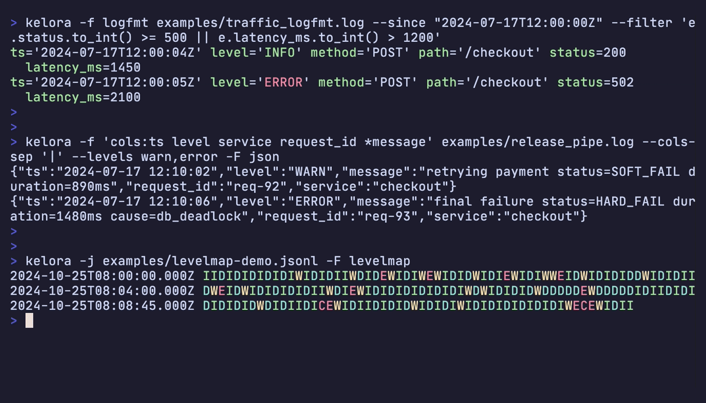

# Kelora

**Scriptable log processor for the command line.**

Parse messy logs into structured events, then filter, transform, and analyze them with embedded [Rhai](https://rhai.rs) scripting.

!!! note "Development Status"
    Pre-1.0 software using AI-generated code validated through automated testing, not manual review. Breaking changes may occur without migration paths. Backed by 770+ tests plus cargo-audit/deny; see the [Security Policy](https://github.com/dloss/kelora/blob/main/SECURITY.md) for details.


*Filtering noisy logs, parsing custom formats, and visualizing log levels*

## Examples

**Spot slow or failing requests**

=== "Command"

    ```bash
    kelora -f logfmt examples/traffic_logfmt.log \
      --since "2024-07-17T12:00:00Z" \
      --filter 'e.status.to_int() >= 500 || e.latency_ms.to_int() > 1200'
    ```

=== "Output"

    ```bash exec="on" source="above" result="ansi"
    kelora -f logfmt examples/traffic_logfmt.log \
      --since "2024-07-17T12:00:00Z" \
      --filter 'e.status.to_int() >= 500 || e.latency_ms.to_int() > 1200'
    ```

=== "Log Data"

    ```bash exec="on" result="ansi"
    cat examples/traffic_logfmt.log
    ```

**Parse custom rollout logs instantly**

=== "Command"

    ```bash
    kelora -f 'cols:ts level service request_id *message' examples/release_pipe.log \
      --cols-sep '|' \
      --levels warn,error \
      -F json
    ```

=== "Output"

    ```bash exec="on" source="above" result="ansi"
    kelora -f 'cols:ts level service request_id *message' examples/release_pipe.log \
      --cols-sep '|' \
      --levels warn,error \
      -F json
    ```

=== "Log Data"

    ```bash exec="on" result="ansi"
    cat examples/release_pipe.log
    ```

**Enrich JSON logs and mask secrets**

=== "Command"

    ```bash
    kelora -j examples/tenant_api.jsonl \
      --exec 'e.tenant = e.path.between("/tenants/", "/"); e.ip = e.ip.mask_ip(2)' \
      --keys timestamp,tenant,ip,event \
      --brief
    ```

=== "Output"

    ```bash exec="on" source="above" result="ansi"
    kelora -j examples/tenant_api.jsonl \
      --exec 'e.tenant = e.path.between("/tenants/", "/"); e.ip = e.ip.mask_ip(2)' \
      --keys timestamp,tenant,ip,event \
      --brief
    ```

=== "Log Data"

    ```bash exec="on" result="ansi"
    cat examples/tenant_api.jsonl
    ```

**Count services in a stream**

=== "Command"

    ```bash
    kelora -j examples/services.jsonl \
      --exec 'track_count(e.service)' \
      --metrics
    ```

=== "Output"

    ```bash exec="on" source="above" result="ansi"
    kelora -j examples/services.jsonl \
      --exec 'track_count(e.service)' \
      --metrics
    ```

=== "Log Data"

    ```bash exec="on" result="ansi"
    cat examples/services.jsonl
    ```

**Detect error bursts with a sliding window**

=== "Command"

    ```bash
    kelora -j examples/deploy_tail.jsonl \
      --window 15 \
      --exec 'let recent = window_values(window, "level");
              if recent.filter(|lvl| lvl == "ERROR").len() >= 3 {
                eprint("burst detected at " + e.timestamp);
              }' \
      -F none
    ```

=== "Output"

    ```bash exec="on" source="above" result="ansi"
    kelora -j examples/deploy_tail.jsonl \
      --window 15 \
      --exec 'let recent = window_values(window, "level");
              if recent.filter(|lvl| lvl == "ERROR").len() >= 3 {
                eprint("burst detected at " + e.timestamp);
              }' \
      -F none
    ```

=== "Log Data"

    ```bash exec="on" result="ansi"
    cat examples/deploy_tail.jsonl
    ```

See the [Quickstart](quickstart.md) for a step-by-step tour with full output.

## What It Does

- **Parse** JSON, logfmt, syslog, CSV/TSV, Apache/Nginx logs, or custom formats
- **Filter** with Rhai expressions - keep events matching your conditions
- **Transform** with 100+ built-in functions - enrich, redact, extract, restructure
- **Analyze** with built-in metrics - track counts, sums, averages, distributions
- **Output** as logfmt, JSON, or CSV

!!! info "Performance Philosophy"
    Kelora is quite slow. It's designed for development logs, debugging sessions, and incident investigations—not production archives. Specialized tools are often 5-100× faster. Kelora trades speed for convenience: one readable command instead of complex pipelines or custom scripts. See [Performance Comparisons](concepts/performance-comparisons.md) for benchmarks.

## How It Works

Kelora processes logs through a streaming pipeline with composable stages:

```
Input → Parse → --exec → --filter → --exec → --filter → ... → Output
  ↓       ↓         ↓         ↓         ↓         ↓              ↓
Files   JSON   transform  narrow   enrich    narrow        logfmt
stdin   syslog                                              JSON
.gz     custom                                              CSV
```

Each `--filter` and `--exec` runs in the order specified, passing events forward. Chain them in any sequence to build multi-stage processing logic. Read the [Pipeline Model](concepts/pipeline-model.md) for details.

## Key Features

- **Resilient Processing** - Skip bad lines automatically, continue processing
- **Parallel Mode** - Process large archives using all CPU cores with `--parallel`
- **Sliding Windows** - Analyze events in context with `--window`
- **100+ Functions** - Rich built-in library for transformation and analysis
- **Format Conversion** - Read any format, write any format
- **Metrics Tracking** - Built-in counters, sums, averages, distributions

## Install

Download from **[GitHub Releases](https://github.com/dloss/kelora/releases)** (macOS, Linux, Windows) or:

```bash
cargo install kelora
```

## Learn More

- **[Quickstart](quickstart.md)** - 5-minute tour
- **[Tutorials](tutorials/index.md)** - Step-by-step guides starting with [the basics](tutorials/basics.md)
- **[How-To](how-to/find-errors-in-logs.md)** - Solve specific problems
- **[Concepts](concepts/pipeline-model.md)** - Understanding how Kelora works
- **[Reference](reference/functions.md)** - Functions, formats, CLI options

Run `kelora --help` for comprehensive command-line help screens, or browse the [example files on GitHub](https://github.com/dloss/kelora/tree/main/examples).

## Works Well With

Kelora focuses on normalising noisy logs into structured data. Reach for it when you need programmable filtering, enrichment, or windowed analytics in one streaming pipeline—and pair it with the tools below when you need deeper visualisation or post-processing:

- **[jq](https://jqlang.github.io/jq/)** — process Kelora's JSON output for complex transformations, filtering, or reformatting
- **[lnav](https://lnav.org/)** — explore Kelora's output in an interactive TUI with live filtering, histograms, and ad-hoc SQL queries
- **[qsv](https://github.com/jqnatividad/qsv)** — analyze Kelora's CSV output with statistical operations, joins, and aggregations
- **[SQLite](https://www.sqlite.org/)/[DuckDB](https://duckdb.org/)** — load Kelora's CSV/JSON output into a database for SQL queries and reporting
- **[miller](https://github.com/johnkerl/miller)** — transform Kelora's CSV output for reshaping, aggregating, and format conversion

!!! tip "Tool Selection Guide"
    Not sure which tool to use for your task? See [Performance Comparisons](concepts/performance-comparisons.md) for honest benchmarks and a decision matrix comparing Kelora with grep, jq, awk, miller, and qsv.

## License

Kelora is open source software licensed under the [MIT License](https://github.com/dloss/kelora/blob/main/LICENSE).
