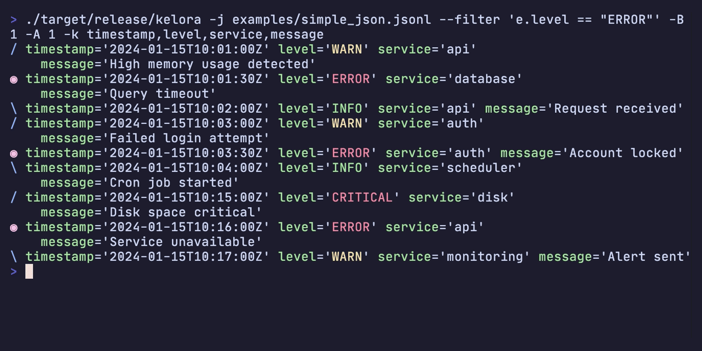

# CLI Reference

Complete command-line interface reference for Kelora. For quick start examples, see the [Quickstart Guide](../quickstart.md).

## Synopsis

```bash
kelora [OPTIONS] [FILES]...
```

## Processing Modes

Kelora supports two processing modes:

| Mode | When to Use | Characteristics |
|------|-------------|-----------------|
| **Sequential (default)** | Streaming, interactive, ordered output | Events processed one at a time in order |
| **Parallel (`--parallel`)** | High-throughput batch processing | Events processed in parallel batches across cores |

## Common Examples

```bash
# Find errors in access logs
kelora access.log --levels error,critical

# Transform JSON logs with Rhai
kelora -j app.json --exec 'e.duration_ms = e.end_time - e.start_time'

# Extract specific fields from NGINX logs
kelora nginx.log -f combined --keys method,status,path
```

## Arguments

### Files

```bash
[FILES]...
```

Input files to process. If omitted, reads from stdin. Use `-` to explicitly specify stdin.

**Examples:**
```bash
kelora app.log                    # Single file
kelora logs/*.jsonl               # Multiple files with glob
kelora file1.log file2.log        # Multiple files explicit
tail -f app.log | kelora -j       # From stdin
kelora -                          # Explicitly read stdin
```

## Global Options

### Help and Version

| Flag | Description |
|------|-------------|
| `-h, --help` | Print complete help (use `-h` for summary) |
| `-V, --version` | Print version information |

### Help Topics

| Flag | Description |
|------|-------------|
| `--help-rhai` | Rhai scripting guide and stage semantics |
| `--help-functions` | All 150+ built-in Rhai functions |
| `--help-examples` | Practical log analysis patterns |
| `--help-time` | Timestamp format reference (chrono format strings) |
| `--help-multiline` | Multi-line event detection strategies |

## Input Options

### Format Selection

#### `-f, --input-format <FORMAT>`

Specify input format. Supports standard formats, column parsing, and CSV with type annotations.

**Standard Formats:**

- `auto` - Auto-detect format from the first line (default)
- `json` - JSON lines (one JSON object per line)
- `line` - Plain text (one line per event)
- `csv` - CSV with header row
- `tsv` - Tab-separated values with header
- `logfmt` - Key-value pairs (logfmt format)
- `syslog` - Syslog RFC5424 and RFC3164
- `combined` - Apache/Nginx log formats (Common + Combined)
- `cef` - ArcSight Common Event Format

**Column Parsing:**
```bash
-f 'cols:timestamp(2) level *message'
```

**CSV with Types:**
```bash
-f 'csv status:int bytes:int response_time:float'
```

**Examples:**
```bash
kelora -f json app.log
kelora -f combined nginx.log
kelora -f 'cols:ts(2) level *msg' custom.log  # `ts` is auto-detected as a timestamp
```

#### `-j`

Shortcut for `-f json`. Only affects input parsing. For JSON output, use `-J` or `-F json`.

```bash
kelora -j app.jsonl
# Equivalent to: kelora -f json app.jsonl
```

### File Processing

#### `--file-order <FILE_ORDER>`

Control file processing order.

**Values:**

- `cli` - Process files in command-line order (default)
- `name` - Sort files alphabetically by name
- `mtime` - Sort files by modification time (oldest first)

```bash
kelora --file-order mtime logs/*.log
```

### Line Filtering

#### `--skip-lines <N>`

Skip the first N input lines.

```bash
kelora --skip-lines 10 app.log
```

#### `--keep-lines <REGEX>`

Keep only input lines matching regex pattern (applied before `--ignore-lines`).

```bash
kelora --keep-lines 'ERROR|WARN' app.log
```

#### `--ignore-lines <REGEX>`

Ignore input lines matching regex pattern.

```bash
kelora --ignore-lines '^#' app.log    # Skip comments
```

### Section Selection

Process specific sections of log files with multiple logical sections.

#### `--section-from <REGEX>`

Start emitting a section from the line that matches (inclusive). Without a stop flag, processing continues until EOF or the next occurrence of the start pattern.

```bash
kelora --section-from '^== iked Logs' system.log
```

#### `--section-after <REGEX>`

Begin the section after the matching line (exclusive start). Useful when headers are just markers.

```bash
kelora --section-after '^== HEADER' --section-before '^==' app.log
```

#### `--section-before <REGEX>`

Stop the section when the regex matches (exclusive end). This mirrors the previous `--section-end` behavior.

```bash
kelora --section-from '^== iked Logs' --section-before '^==' system.log
```

#### `--section-through <REGEX>`

Stop only after emitting the matching line (inclusive end). Handy when the footer carries status information.

```bash
kelora --section-from '^BEGIN' --section-through '^END$' build.log
```

#### `--max-sections <N>`

Maximum number of sections to process. Default: -1 (unlimited).

```bash
# Process first 2 sections
kelora --section-from '^== ' --max-sections 2 system.log

# Process only first section
kelora --section-from '^Session' --section-before '^End' --max-sections 1 app.log
```

**Processing Order:**

Section selection runs early in the pipeline, before `--keep-lines` and `--ignore-lines`:

1. `--skip-lines` - Skip first N lines
2. **`--section-from/after/before/through`** - Select sections
3. `--keep-lines` - Keep matching lines within sections
4. `--ignore-lines` - Ignore matching lines within sections
5. `-M/--multiline` - Group lines into events
6. Parsing - Parse into structured events

**Use Cases:**

```bash
# Extract specific service logs from docker-compose output
docker compose logs | kelora --section-from '^web_1' --section-before '^(db_1|api_1)' -f line

# Process first 3 user sessions
kelora --section-from 'User .* logged in' --section-through 'logged out' --max-sections 3 app.log

# Extract iked section, then filter for errors
kelora --section-after '^== iked' --section-before '^==' --keep-lines 'ERROR' system.log
```

**Performance:**

- Section selection is single-threaded (even with `--parallel`)
- Minimal overhead - just regex matching per line
- Heavy processing (parsing, filtering, Rhai) still parallelizes
- No full-file buffering - processes line-by-line

### Timestamp Configuration {#timestamp-options}

#### `--ts-field <FIELD>`

Custom timestamp field name for parsing. When set, Kelora only inspects that field; the built-in fallbacks are disabled so missing or malformed values stay visible in stats and diagnostics.

```bash
kelora -j --ts-field created_at app.log
```

#### `--ts-format <FORMAT>`

Custom timestamp format using chrono format strings. See `--help-time` for format reference.

```bash
kelora --ts-format '%Y-%m-%d %H:%M:%S' app.log
kelora --ts-format '%d/%b/%Y:%H:%M:%S %z' access.log
```

#### `--input-tz <TIMEZONE>`

Timezone for naive input timestamps (without timezone info). Default: UTC.

**Values:**

- `UTC` - Coordinated Universal Time
- `local` - System local time
- Named timezones: `Europe/Berlin`, `America/New_York`, etc.

```bash
kelora --input-tz local app.log
kelora --input-tz Europe/Berlin app.log
```

### Multi-line Events

#### `-M, --multiline <STRATEGY>`

Multi-line event detection strategy. Value format: `<strategy>[:key=value[:key=value...]]`. Supported strategies:

- `timestamp` — optional `format=` hint (e.g., `timestamp:format=%Y-%m-%d %H-%M-%S`)  
  *(Literal `:` characters in the format string are not supported yet.)*

- `indent`
- `regex` — requires `match=REGEX`, optional `end=REGEX`
- `all`

```bash
kelora -M all config.json                        # Entire input as one event
kelora -M timestamp app.log                      # Auto-detect timestamp headers
kelora -M 'timestamp:format=%Y-%m-%d %H-%M-%S' app.log
kelora -M 'regex:match=^\\d{4}-' app.log         # Start pattern only
kelora -M 'regex:match=^START:end=^END$' app.log # Start + end patterns
```

### Prefix Extraction

#### `--extract-prefix <FIELD>`

Extract text before separator to specified field (runs before parsing).

```bash
docker compose logs | kelora --extract-prefix service
```

#### `--prefix-sep <STRING>`

Separator string for prefix extraction. Default: `|`

```bash
kelora --extract-prefix node --prefix-sep ' :: ' cluster.log
```

### Column Format Options

#### `--cols-sep <SEPARATOR>`

Column separator for `cols:<spec>` format. Default: whitespace.

```bash
kelora -f 'cols:name age city' --cols-sep ',' data.txt
```

## Processing Options

### Scripting Stages

#### `--begin <SCRIPT>`

Run Rhai script once before processing any events. Typical use: initialize lookup tables or shared context in the global `conf` map.

**Available helpers:**

- `read_lines(path)` - Read file as array of lines
- `read_file(path)` - Read file as string

```bash
kelora -j --begin 'conf.users = read_json("users.json")' app.log
```

#### `--filter <EXPRESSION>`

Boolean filter expression. Events where expression returns `true` are kept. Multiple filters are combined with AND logic.

```bash
kelora -j --filter 'e.status >= 400' app.log
kelora -j -l error --filter 'e.service == "api"' app.log   # Use -l for level filtering (faster than Rhai)
```

#### `-e, --exec <SCRIPT>`

Transform/process script evaluated on each event. Multiple `--exec` scripts run in order.

```bash
kelora -j --exec 'e.duration_s = e.duration_ms / 1000' app.log
kelora -j --exec 'track_count(e.service)' app.log
```

#### `-E, --exec-file <FILE>`

Execute Rhai script from file (runs in exec stage).

```bash
kelora -j -E transform.rhai app.log
```

#### `-I, --include <FILE>`

Include Rhai files before script stages (library imports).

```bash
kelora -j -I helpers.rhai --exec 'e.custom = my_helper(e)' app.log
```

#### `--end <SCRIPT>`

Run once after processing completes (post-processing stage). Access global `metrics` map from `track_*()` calls here.

```bash
kelora -j \
    --exec 'track_count(e.service)' \
    --end 'print("Total services: " + metrics.len())' \
    app.log
```

### Span Aggregation

#### `--span <N | DURATION | FIELD>`

Group events into non-overlapping spans before running a span-close hook. Sequential mode is required (Kelora prints a warning and falls back to sequential if `--parallel` is also supplied).

- `--span <N>` – Count-based spans. Close after every **N** events that survive all filters. Example: `--span 500`.
- `--span <DURATION>` – Time-based spans aligned to the events' canonical timestamp (`ts`). The first event with a valid `ts` anchors fixed windows such as `1m`, `5m`, `30s`, `1h`.
- `--span <FIELD>` – Field-based spans. Open a new span whenever the field value changes. With the single-active-span model, interleaved IDs (`req-1, req-2, req-1`) produce multiple spans per ID.

How it works:

- Per-event scripts still run for every event.
- Events missing a timestamp (time mode) are marked `meta.span_status == "unassigned"` and excluded from the span buffer.
- Events with timestamps that fall into an already-closed window are emitted immediately with `meta.span_status == "late"`. Closed spans are never reopened.
- Count spans keep buffered events in memory until the span closes. Kelora warns when `N > 100_000`.
- Field spans continue the current span when the field is missing (error with `--strict`).

#### `--span-idle <DURATION>`

Close spans after a period of inactivity (no events). Requires timestamps and cannot be combined with `--span`.

- Opens a span on the first event with a timestamp; closes when the forward gap between events exceeds the timeout.
- Span IDs use `idle-#<seq>-<start_timestamp>`.
- Missing timestamps: tagged `unassigned` (errors with `--strict`).
- Interleaved/out-of-order events do not close spans; only forward-time gaps are considered. Sort input if you need strict wall-clock ordering.

#### `--span-close <SCRIPT>`

Run a Rhai snippet once whenever a span closes. Use it to emit per-span summaries, metrics, or rollups. The script runs after the event that triggered the close finishes all per-event stages (filters, execs, etc.).

**Read-only span object available inside `--span-close`:**

- `span.id` – Unique span identifier (`#0`, `2024-05-19T12:00:00Z/5m`, etc.)
- `span.start` / `span.end` – Half-open window bounds for time-based spans (count spans return `()`)
- `span.size` – Number of events that survived filters and were included in this span
- `span.events` – Array of events in arrival order (each map includes `span_status`, `span_start`, etc.)
- `span.metrics` – Map of per-span deltas from `track_*` calls (automatically reset after each span)

**Metadata added to `meta` during per-event stages:**

- `meta.parsed_ts` – Parsed UTC timestamp before any `--filter`/`--exec` scripts (or `()` when absent)
- `meta.span_status` – `"included"`, `"late"`, `"unassigned"`, or `"filtered"`
- `meta.span_id` – Span identifier (`null` for unassigned events)
- `meta.span_start`, `meta.span_end` – Boundaries as DateTime values (or `()` when not applicable)

Kelora cleans up span state automatically when processing completes or on graceful shutdown.

### File System Access

#### `--allow-fs-writes`

Allow Rhai scripts to create directories and write files. Required for file helpers like `append_file()` or `mkdir()`.

```bash
kelora -j --allow-fs-writes --exec 'append_file("errors.txt", e.message)' app.log
```

### Window Functions

#### `--window <SIZE>`

Enable sliding window of N+1 recent events. The window is exposed as the `window` array, so you can call helpers like `window.pluck()`.

```bash
kelora -j --window 5 --exec 'e.recent_statuses = window.pluck("status")' app.log
```

### Timestamp Conversion

#### `--normalize-ts`

Normalize the primary timestamp field (the one Kelora uses for filtering and stats) to RFC3339 (ISO 8601). Runs after Rhai scripts and affects every output formatter.

```bash
kelora -j --normalize-ts app.log
```

## Error Handling Options

### Strict Mode

#### `--strict`

Exit on first error (fail-fast behavior). Parsing errors, filter errors, or exec errors will immediately abort processing.

```bash
kelora -j --strict app.log
```

#### `--no-strict`

Disable strict mode explicitly (resilient mode is default).

### Verbosity

#### `-v, --verbose`

Show detailed error information. Use multiple times for more verbosity: `-v`, `-vv`, `-vvv`.

```bash
kelora -j --verbose app.log
```

### Output/Quiet Controls

#### `-q` / `--quiet`

Suppress formatter output (events). Diagnostics, stats, metrics, and script output remain unless further flags are used.

```bash
kelora -q app.log                         # No events, diagnostics still emit
kelora -s app.log                         # Stats only (events suppressed automatically)
kelora -m app.log                         # Metrics only (events suppressed automatically)
```

#### `--diagnostics` / `--no-diagnostics`

Enable or suppress diagnostics and error summaries. By default, diagnostics are enabled. Use `--diagnostics` to override a `--no-diagnostics` setting from your config file.

```bash
kelora -q --no-diagnostics app.log        # No events, no diagnostics
kelora --diagnostics app.log              # Override config default
```

**Note:** When both flags are present, the last one wins. A single fatal line is still emitted on errors even with `--no-diagnostics`.

#### `--silent` / `--no-silent`

Suppress pipeline emitters on stdout/stderr (events, diagnostics, stats, terminal metrics). Script output stays enabled unless you also use `--no-script-output` or data-only modes. Metrics files still write. A single fatal line is emitted on errors. `--no-silent` disables a silent default from config.

```bash
kelora --silent --metrics-file out.json app.log   # Quiet terminal, metrics file written
```

#### `--script-output` / `--no-script-output`

Enable or suppress Rhai `print`/`eprint` and side-effect warnings. By default, script output is enabled. Use `--script-output` to override a `--no-script-output` setting from your config file.

```bash
kelora --no-script-output app.log         # Suppress script prints
kelora --script-output app.log            # Override config default
```

**Note:** When both flags are present, the last one wins. `--no-script-output` is implied by data-only modes (`-s`, `-m` without `--with-*` flags).

## Filtering Options

### Level Filtering

#### `-l, --levels <LEVELS>`

Include only events with specified log levels (case-insensitive). Every occurrence runs exactly where it appears in the CLI, so you can place `-l` before heavy `--exec` stages (to prune work early) or repeat it later after you derive a new level.

```bash
kelora -j --levels error app.log
kelora -j --levels error,warn,critical app.log
kelora -j --exec 'if !e.has("level") { e.level = "WARN" }' --levels warn log.txt  # Add level, then filter
```

#### `-L, --exclude-levels <LEVELS>`

Exclude events with specified log levels (case-insensitive). Like `--levels`, you may repeat this flag to drop different levels at multiple points in the pipeline.

```bash
kelora -j --exclude-levels debug,trace app.log
kelora -j --levels error --exec 'if e.service == "chat" { e.level = "WARN" }' \
    --exclude-levels warn app.log
```

### Field Selection

#### `-k, --keys <FIELDS>`

Output only specified top-level fields (comma-separated list).

```bash
kelora -j --keys timestamp,level,message app.log
```

#### `-K, --exclude-keys <FIELDS>`

Exclude specified fields from output (comma-separated list).

```bash
kelora -j --exclude-keys password,token,secret app.log
```

### Time Range Filtering

#### `--since <TIME>`

Include events from this time onward. Accepts journalctl-style timestamps.

**Formats:**

- Absolute: `2024-01-15T12:00:00Z`, `2024-01-15 12:00`, `10:30:00`
- Relative: `1h`, `-30m`, `yesterday`, `now`, `today`
- Anchored: `end+1h`, `end-30m` (relative to `--until` value)

```bash
kelora -j --since '1 hour ago' app.log
kelora -j --since yesterday app.log
kelora -j --since 2024-01-15T10:00:00Z app.log

# Duration before end time
kelora -j --since "end-1h" --until "11:00" app.log
```

**See Also:** [Time Reference](time-reference.md#time-range-filtering) for complete timestamp syntax.

#### `--until <TIME>`

Include events until this time. Accepts journalctl-style timestamps.

**Formats:**

- Absolute: `2024-01-15T12:00:00Z`, `2024-01-15 12:00`, `18:00:00`
- Relative: `1h`, `+30m`, `tomorrow`, `now`
- Anchored: `start+30m`, `start-1h` (relative to `--since` value)

```bash
kelora -j --until '30 minutes ago' app.log
kelora -j --until tomorrow app.log
kelora -j --until 2024-01-15T18:00:00Z app.log

# Duration after start time
kelora -j --since "10:00" --until "start+30m" app.log
```

**Anchored Timestamp Examples:**

Anchor one boundary to the other for duration-based windows:

```bash
# 30 minutes starting at 10:00
kelora --since "10:00" --until "start+30m" app.log

# 1 hour ending at 11:00
kelora --since "end-1h" --until "11:00" app.log

# 2 hours starting from yesterday
kelora --since "yesterday" --until "start+2h" app.log
```

**Important:** Cannot use both anchors in the same command (e.g., `--since end-1h --until start+1h` is an error).

**See Also:** [Time Reference](time-reference.md#time-range-filtering) for complete timestamp syntax.

### Output Limiting

#### `-n, --take <N>`

Limit output to the first N events (after filtering).

```bash
kelora -j --take 100 app.log
kelora -j --levels error --take 10 app.log
```

### Context Lines

#### `-B, --before-context <N>`

Show N lines before each match (requires filtering with `--filter` or `--levels`).

```bash
kelora -j --levels error --before-context 2 app.log
```

#### `-A, --after-context <N>`

Show N lines after each match (requires filtering).

```bash
kelora -j --levels error --after-context 3 app.log
```

#### `-C, --context <N>`

Show N lines before and after each match (requires filtering).

```bash
kelora -j --levels error --context 2 app.log
```

**Visual Example:**



Context lines are highlighted with colored symbols: `/` for before-context, `*` for matching lines, `\` for after-context, and `|` for separator lines.

## Output Options

### Output Format

#### `-F, --output-format <FORMAT>`

Output format. Default: `default`

**Values:**

- `default` - Key-value format with colors
- `json` - JSON lines (one object per line)
- `logfmt` - Key-value pairs (logfmt format)
- `inspect` - Debug format with type information
- `levelmap` - Grouped by log level
- `keymap` - Shows first character of specified field (requires `--keymap-key`)
- `csv` - CSV with header
- `tsv` - Tab-separated values with header
- `csvnh` - CSV without header
- `tsvnh` - TSV without header

```bash
kelora -j -F json app.log
kelora -j -F csv app.log
kelora -F keymap --keymap-key status app.log
kelora -j --stats app.log
```

#### `--keymap-key <field>`

Specify the field name to use with the `keymap` output format. Required when using `-F keymap`.

The keymap format displays the first character of the specified field value for each event, or `.` if the field is empty or missing. Events are grouped by timestamp similar to `levelmap`.

```bash
kelora -F keymap --keymap-key method access.log    # Show first char of HTTP method
kelora -F keymap --keymap-key status api.log       # Show first char of status field
```

#### `-J`

Shortcut for `-F json`.

```bash
kelora -j -J app.log
# Equivalent to: kelora -f json -F json app.log
```

### Output Destination

#### `-o, --output-file <FILE>`

Write formatted events to file instead of stdout.

```bash
kelora -j -F json -o output.json app.log
```

### Core Fields

#### `-c, --core`

Output only core fields (timestamp, level, message).

```bash
kelora -j --core app.log
```

## Default Format Options

These options only affect the default formatter (`-F default`).

### Brief Mode

#### `-b, --brief`

Output only field values (omit field names).

```bash
kelora -j --brief app.log
```

### Nested Structures

#### `--expand-nested`

Expand nested structures (maps/arrays) with indentation.

```bash
kelora -j --expand-nested app.log
```

### Word Wrapping

#### `--wrap`

Enable word-wrapping (default: on).

#### `--no-wrap`

Disable word-wrapping (overrides `--wrap`).

```bash
kelora -j --no-wrap app.log
```

### Timestamp Display

#### `-z, --show-ts-local`

Display timestamps as local RFC3339 (ISO 8601 compatible). Display-only - only affects default formatter output.

```bash
kelora -j -z app.log
# Output: 2024-01-15T10:30:00+01:00
```

#### `-Z, --show-ts-utc`

Display timestamps as UTC RFC3339 (ISO 8601 compatible). Display-only - only affects default formatter output.

```bash
kelora -j -Z app.log
# Output: 2024-01-15T09:30:00Z
```

## Display Options

### Colors

#### `--force-color` / `--no-color`

Force colored output always, or disable it completely. By default, Kelora auto-detects color support based on TTY status and the `NO_COLOR`/`FORCE_COLOR` environment variables.

```bash
kelora -j --force-color app.log > output.txt   # Force color even when piping
kelora -j --no-color app.log                   # Disable colors
```

**Note:** When both flags are present, the last one wins. This allows overriding config file defaults.

### Gap Markers

#### `--mark-gaps <DURATION>`

Insert centered marker when time delta between events exceeds duration.

```bash
kelora -j --mark-gaps 30s app.log    # Mark 30+ second gaps
kelora -j --mark-gaps 5m app.log     # Mark 5+ minute gaps
```

**Visual Example:**


Gap markers help identify time discontinuities in your logs, making it easier to spot service restarts, network issues, or other temporal anomalies.

### Emoji

#### `--force-emoji` / `--no-emoji`

Force emoji prefixes always, or disable them completely. By default, Kelora auto-detects emoji support based on color settings and the `NO_EMOJI` environment variable.

```bash
kelora -j --force-emoji app.log    # Force emoji even in NO_EMOJI env
kelora -j --no-emoji app.log       # Disable emoji
```

**Note:** When both flags are present, the last one wins. This allows overriding config file defaults. Emoji requires color to be enabled.

## Performance Options

### Parallel Processing

#### `--parallel`

Enable parallel processing across multiple cores. Higher throughput, may reorder output.

```bash
kelora -j --parallel app.log
```

#### `--no-parallel`

Disable parallel processing explicitly (sequential mode is default).

#### `--threads <N>`

Number of worker threads for parallel processing. Default: 0 (auto-detect cores).

```bash
kelora -j --parallel --threads 4 app.log
```

#### `--batch-size <N>`

Batch size for parallel processing. Larger batches improve throughput but increase memory usage.

```bash
kelora -j --parallel --batch-size 5000 app.log
```

#### `--batch-timeout <MS>`

Flush partially full batches after idle period (milliseconds). Lower values reduce latency; higher values improve throughput.

Default: 200ms

```bash
kelora -j --parallel --batch-timeout 100 app.log
```

#### `--unordered`

Disable ordered output for maximum parallel performance.

```bash
kelora -j --parallel --unordered app.log
```

## Metrics and Statistics

### Statistics

#### `-s, --stats[=FORMAT]`

Show stats only (implies `-q/--quiet`). Use `-s` for default table format, or `--stats=FORMAT` for explicit format.

Formats: `table`, `json`

```bash
kelora -j -s app.log                    # Default table format
kelora -j --stats=json app.log          # JSON format
```

#### `--with-stats`

Show stats alongside events (rare case).

```bash
kelora -j --with-stats app.log
```

#### `--no-stats`

Disable processing statistics explicitly (default: off).

### Tracked Metrics

#### `-m, --metrics[=FORMAT]`

Show metrics only (implies `-q/--quiet`). Use `-m` for default full table format, or `--metrics=FORMAT` for explicit format.

Formats: `short` (first 5 items), `full` (default), `json`

```bash
kelora -j --exec 'track_count(e.service)' -m app.log               # Default full table
kelora -j --exec 'track_count(e.service)' --metrics=short app.log  # Abbreviated (first 5)
kelora -j --exec 'track_count(e.service)' --metrics=json app.log   # JSON format
```

#### `--with-metrics`

Show metrics alongside events (rare case).

```bash
kelora -j --exec 'track_count(e.service)' --with-metrics app.log
```

#### `--no-metrics`

Disable tracked metrics explicitly (default: off).

#### `--metrics-file <FILE>`

Persist metrics map to disk as JSON.

```bash
kelora -j --exec 'track_count(e.service)' --metrics-file metrics.json app.log
```

## Configuration Options

### Configuration File

Kelora uses a configuration file for defaults and aliases. See [Configuration System](../concepts/configuration-system.md) for details.

#### `-a, --alias <ALIAS>`

Use alias from configuration file.

```bash
kelora -a errors app.log
```

#### `--config-file <FILE>`

Specify custom configuration file path.

```bash
kelora --config-file /path/to/custom.ini app.log
```

#### `--show-config`

Show current configuration with precedence information and exit.

```bash
kelora --show-config
```

#### `--edit-config`

Edit configuration file in default editor and exit.

```bash
kelora --edit-config
```

#### `--ignore-config`

Ignore configuration file (use built-in defaults only).

```bash
kelora --ignore-config app.log
```

#### `--save-alias <NAME>`

Save current command as alias to configuration file.

```bash
kelora -j --levels error --keys timestamp,message --save-alias errors
# Later use: kelora -a errors app.log
```

## Exit Codes

Kelora uses standard Unix exit codes to indicate success or failure:

| Code | Meaning |
|------|---------|
| `0` | Success - no errors occurred |
| `1` | Processing errors (parse/filter/exec/file errors) |
| `2` | Usage errors (invalid flags, incompatible options, config errors) |
| `130` | Interrupted (Ctrl+C / SIGINT) |
| `141` | Broken pipe (SIGPIPE - normal in pipelines) |
| `143` | Terminated (SIGTERM) |

For detailed information on exit codes, error handling modes, scripting patterns, and troubleshooting, see the [Exit Codes Reference](exit-codes.md).

## Environment Variables

### Configuration

- **`TZ`** - Default timezone for naive timestamps (overridden by `--input-tz`)

### Rhai Scripts

Access environment variables in scripts using `get_env()`:

```bash
kelora -j --exec 'e.build = get_env("BUILD_ID", "unknown")' app.log
```

## Common Option Combinations

### Error Analysis

```bash
# Find errors with context
kelora -j --levels error --context 2 app.log

# Count errors by service
kelora -j --levels error --exec 'track_count(e.service)' --metrics app.log
```

### Performance Analysis

```bash
# Find slow requests
kelora -f combined --filter 'e.request_time.to_float() > 1.0' nginx.log

# Track response time percentiles
kelora -f combined \
    --exec 'track_bucket("latency", e.request_time.to_float() * 1000)' \
    --metrics nginx.log
```

### Data Export

```bash
# Export to JSON
kelora -j -F json -o output.json app.log

# Export to CSV
kelora -j -F csv --keys timestamp,level,service,message -o report.csv app.log
```

### Real-Time Monitoring

=== "Linux/macOS"

    ```bash
    tail -f app.log | kelora -j -l error,warn
    ```

=== "Windows"

    ```powershell
    Get-Content -Wait app.log | kelora -j -l error,warn
    ```

### High-Performance Batch Processing

```bash
# Parallel processing with optimal batch size
kelora -j --parallel --batch-size 5000 --unordered large.log

# Compressed archives
kelora -j --parallel logs/*.log.gz
```

## See Also

- [Quickstart Guide](../quickstart.md) - Get started in 5 minutes
- [Function Reference](functions.md) - All 150+ built-in Rhai functions
- [Pipeline Model](../concepts/pipeline-model.md) - How processing stages work
- [Configuration System](../concepts/configuration-system.md) - Configuration files and aliases
