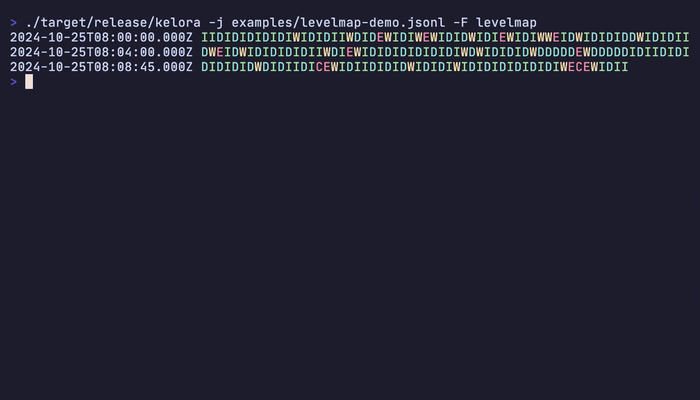

# Format Reference

Quick reference for all formats supported by Kelora.

## Input Formats

Specify input format with `-f, --input-format <format>`.

### Overview

| Format | Description |
|--------|----------|
| `auto` | Auto-detect from first line (default) |
| `json` | Application logs, structured data (shorthand: `-j`) |
| `line` | Unstructured logs, raw text |
| `logfmt` | Heroku-style logs, simple structured logs |
| `csv` / `tsv` | Spreadsheet data, exports |
| `syslog` | System logs, network devices |
| `combined` | Apache/Nginx web server access logs |
| `cef` | ArcSight Common Event Format, SIEM data |
| `cols:<spec>` | Custom column-based logs |
| `regex:<pattern>` | Custom regex parsing with named groups and type annotations |

### JSON Format

**Syntax:** `-f json` or `-j`

**Description:** JSON Lines format (one object per line). Nested structures preserved.

**Input Example:**
```json
{"timestamp": "2024-01-15T10:30:00Z", "level": "ERROR", "service": "api", "message": "Connection failed"}
```

**Output Fields:** All JSON fields become event fields with original names and types.

**Notes:**

- Use `-M json` for multi-line JSON objects
- Preserves field types (strings, numbers, booleans, null)
- Supports nested objects and arrays

### Line Format

**Syntax:** `-f line`

**Description:** Plain text, one line per event.

**Output Fields:**

| Field | Type | Description |
|-------|------|-------------|
| `line` | String | Complete line content |

**Notes:**

- Auto-detect falls back to line when it can't identify a structured format
- Empty lines are skipped
- Useful for unstructured logs or custom parsing with `--exec`

### Logfmt Format

**Syntax:** `-f logfmt`

**Description:** Heroku-style key-value pairs.

**Input Example:**
```
timestamp=2024-01-15T10:30:00Z level=ERROR service=api message="Connection failed"
```

**Output Fields:** All key-value pairs become top-level fields.

**Notes:**

- Supports quoted values: `key="value with spaces"`
- Keys must be alphanumeric (with underscores/hyphens)

### CSV / TSV Formats

**Syntax:**

- `-f csv` - Comma-separated with header
- `-f tsv` - Tab-separated with header
- `-f csvnh` - CSV without header
- `-f tsvnh` - TSV without header

**Output Fields:**

- **With header:** Field names from header row
- **Without header:** `col_0`, `col_1`, `col_2`, etc.

**Type Annotations:**

Specify field types for automatic conversion:
```bash
kelora -f 'csv status:int bytes:int response_time:float' access.csv
```

Supported types: `int`, `float`, `bool`

**Notes:**

- Quoted fields supported: `"value, with, commas"`
- Escaped quotes: `"value with ""quotes"""`

### Syslog Format

**Syntax:** `-f syslog`

**Description:** RFC5424 and RFC3164 syslog messages. Auto-detects format.

**Input Examples:**

RFC5424:
```
<165>1 2024-01-15T10:30:00.000Z myhost myapp 1234 ID47 - Connection failed
```

RFC3164:
```
<34>Jan 15 10:30:00 myhost myapp[1234]: Connection failed
```

**Output Fields:**

| Field | Type | RFC5424 | RFC3164 | Description |
|-------|------|---------|---------|-------------|
| `pri` | Integer | ✓ | ✓* | Priority value (facility * 8 + severity) |
| `facility` | Integer | ✓ | ✓* | Syslog facility code |
| `severity` | Integer | ✓ | ✓* | Severity level (0-7) |
| `level` | String | ✓ | ✓* | Log level (EMERG, ALERT, CRIT, ERROR, WARN, NOTICE, INFO, DEBUG) |
| `ts` | String | ✓ | ✓ | Parsed timestamp |
| `host` | String | ✓ | ✓ | Source hostname |
| `prog` | String | ✓ | ✓ | Application/program name |
| `pid` | Integer/String | ✓ | ✓ | Process ID (parsed as integer if numeric) |
| `msgid` | String | ✓ | - | Message ID |
| `version` | Integer | ✓ | - | Syslog protocol version |
| `msg` | String | ✓ | ✓ | Log message |

*RFC3164: Only present if priority prefix `<NNN>` is included

**Notes:**

- Severity levels: 0=emerg, 1=alert, 2=crit, 3=err, 4=warn, 5=notice, 6=info, 7=debug

### Combined Log Format

**Syntax:** `-f combined`

**Description:** Apache/Nginx web server logs. Auto-handles three variants:

- Apache Common Log Format (CLF)
- Apache Combined Log Format
- Nginx Combined with request_time

**Input Examples:**

Common:
```
192.168.1.1 - user [15/Jan/2024:10:30:00 +0000] "GET /index.html HTTP/1.0" 200 1234
```

Combined:
```
192.168.1.1 - user [15/Jan/2024:10:30:00 +0000] "GET /api/data HTTP/1.1" 200 1234 "http://example.com/" "Mozilla/5.0"
```

Nginx with request_time:
```
192.168.1.1 - - [15/Jan/2024:10:30:00 +0000] "GET /api/data HTTP/1.1" 200 1234 "-" "curl/7.68.0" "0.123"
```

**Output Fields:**

| Field | Type | Common | Combined | Nginx | Description |
|-------|------|--------|----------|-------|-------------|
| `ip` | String | ✓ | ✓ | ✓ | Client IP address |
| `identity` | String | ✓ | ✓ | ✓ | RFC 1413 identity (omit if `-`) |
| `user` | String | ✓ | ✓ | ✓ | HTTP auth username (omit if `-`) |
| `ts` | String | ✓ | ✓ | ✓ | Request timestamp |
| `request` | String | ✓ | ✓ | ✓ | Full HTTP request line |
| `method` | String | ✓ | ✓ | ✓ | HTTP method (auto-extracted) |
| `path` | String | ✓ | ✓ | ✓ | Request path (auto-extracted) |
| `protocol` | String | ✓ | ✓ | ✓ | HTTP protocol (auto-extracted) |
| `status` | Integer | ✓ | ✓ | ✓ | HTTP status code |
| `bytes` | Integer | ✓ | ✓ | ✓ | Response size (omit if `-`, keep if `0`) |
| `referer` | String | - | ✓ | ✓ | HTTP referer (omit if `-`) |
| `user_agent` | String | - | ✓ | ✓ | HTTP user agent (omit if `-`) |
| `request_time` | Float | - | - | ✓ | Request time in seconds (omit if `-`) |

**Notes:**

- Parser auto-detects variant per line
- Fields with `-` values omitted (except `bytes` includes `0`)

### CEF Format

**Syntax:** `-f cef`

**Description:** ArcSight Common Event Format for security logs.

**Input Example:**
```
CEF:0|Security|threatmanager|1.0|100|worm successfully stopped|10|src=10.0.0.1 dst=2.1.2.2 spt=1232
```

**Output Fields:**

**Syslog prefix (optional):**

| Field | Type | Description |
|-------|------|-------------|
| `ts` | String | Timestamp from syslog prefix |
| `host` | String | Hostname from syslog prefix |

**CEF header:**

| Field | Type | Description |
|-------|------|-------------|
| `cefver` | String | CEF format version |
| `vendor` | String | Device vendor name |
| `product` | String | Device product name |
| `version` | String | Device version |
| `eventid` | String | Event signature ID |
| `event` | String | Event name/classification |
| `severity` | String | Event severity (0-10) |

**Extensions:** All extension key=value pairs become top-level fields with automatic type conversion (integers, floats, booleans)

### Column Format

**Syntax:** `-f 'cols:<spec>'`

**Description:** Custom column-based parsing with whitespace (or custom separator) splitting.

**Separator:** Use `--cols-sep <separator>` for custom separators (default: whitespace)

**Specification Syntax:**

- `field` - Consume one column
- `field(N)` - Consume N columns and join
- `-` or `-(N)` - Skip one or N columns
- `*field` - Capture remaining columns (must be last)
- `field:type` - Apply type annotation (`int`, `float`, `bool`, `string`)

**Examples:**

Simple fields:
```bash
# Input: ERROR api "Connection failed"
kelora -f 'cols:level service *msg' app.log
```

Multi-token timestamp:
```bash
# Input: 2024-01-15 10:30:00 INFO Connection failed
kelora -f 'cols:ts(2) level *msg' app.log --ts-field ts
```

Custom separator:
```bash
# Input: name|age|city
kelora -f 'cols:name age:int city' --cols-sep '|' data.txt
```

**Output Fields:** Field names from specification with applied type conversions.

**Notes:**

- `*field` must be the final token

### Regex Format

**Syntax:** `-f 'regex:<pattern>'`

**Description:** Parse logs using regular expressions with named capture groups and optional type annotations.

**Pattern Syntax:**

- `(?P<name>pattern)` - Named capture group (field stored as string)
- `(?P<name:type>pattern)` - Named capture group with type annotation

**Supported Types:** `int`, `float`, `bool` (lowercase only)

**Examples:**

Simple extraction:
```bash
# Input: 404 Not found
kelora -f 'regex:(?P<code:int>\d+) (?P<msg>.*)' app.log
```

Structured logs:
```bash
# Input: 2025-01-15T10:00:00Z [ERROR] Database connection failed
kelora -f 'regex:^(?P<ts>\S+) \[(?P<level>\w+)\] (?P<msg>.+)$' app.log
```

Apache-style logs with typed fields:
```bash
# Input: 192.168.1.1 - - [15/Jan/2025:10:00:00 +0000] "GET /api/users HTTP/1.1" 200 1234
kelora -f 'regex:^(?P<ip>\S+) - - \[(?P<timestamp>[^\]]+)\] "(?P<method>\w+) (?P<path>\S+) HTTP/[\d.]+" (?P<status:int>\d+) (?P<bytes:int>\d+)$' access.log
```

**Output Fields:** Field names from capture groups with applied type conversions.

**Behavior:**

- **Full-line matching:** Pattern implicitly anchored with `^...$`
- **Empty captures:** Skipped (not stored as fields)
- **Non-matching lines:**
    - Default (lenient): Returns error, line skipped, processing continues
    - With `--strict`: Returns error, processing halts
- **Type conversion failures** (e.g., `"abc"` for `:int`):
    - Default (lenient): Automatically falls back to storing as string
    - With `--strict`: Returns error, processing halts

**Reserved Field Names:**

The following names cannot be used: `original_line`, `parsed_ts`, `fields`

**Limitations:**

- Nested named capture groups are not supported
- Type annotations must be lowercase (`:int`, not `:INT`)

**Notes:**

- Use raw strings in shell to avoid escaping issues: `-f 'regex:...'`
- Combine with `--ts-field` to specify which field contains the timestamp
- Non-capturing groups `(?:...)` are supported

### Auto-Detection

**Syntax:** `-f auto`

**Description:** Automatically detect format from first non-empty line.

**Detection Order:**

1. JSON (starts with `{`)
2. Syslog (starts with `<NNN>`)
3. CEF (starts with `CEF:`)
4. Combined (matches Apache/Nginx pattern)
5. Logfmt (contains `key=value` pairs)
6. CSV (contains commas with consistent pattern)
7. Line (fallback)

**Notes:**

- Detects once, applies to all lines
- Not suitable for mixed-format files

## Output Formats

Specify output format with `-F, --output-format <format>`.

| Format | Description |
|--------|-------------|
| `default` | Key-value format with colors |
| `json` | JSON lines (one object per line) |
| `logfmt` | Key-value pairs (logfmt format) |
| `inspect` | Debug format with type information |
| `levelmap` | Events grouped by log level |
| `keymap` | Shows first character of specified field (requires `--keys` with exactly one field) |
| `csv` | CSV with header row |
| `tsv` | Tab-separated values with header row |
| `csvnh` | CSV without header |
| `tsvnh` | TSV without header |

Use `-q/--quiet` to suppress output (implied by `--stats` and `--metrics`).

**Levelmap Visual Example:**



The `levelmap` format provides a compact visual representation of logs, showing timestamps and level indicators in a condensed format ideal for quick scanning.

**Keymap Format:**

The `keymap` format works similarly to `levelmap` but displays the first character of any specified field instead of being limited to log levels. This is useful for visualizing patterns in custom fields like HTTP methods, status codes, user types, etc.

- Requires `--keys` (or `-k`) with exactly one field name
- Shows the first character of the field value (converted to string for non-string fields)
- Displays `.` for empty or missing field values
- Groups events by timestamp like `levelmap`
- Not compatible with `--parallel` mode

**Examples:**
```bash
kelora -j app.log -F json                      # Output as JSON
kelora -j app.log -F csv --keys ts,level,msg   # Output as CSV
kelora -F keymap -k method access.log          # Show HTTP method patterns
kelora -F keymap --keys status api.log         # Show status field patterns
kelora -j app.log --stats                      # Only stats
```

## See Also

- [CLI Reference](cli-reference.md) - Complete flag documentation including timestamp parsing, multiline strategies, and prefix extraction
- [Quickstart](../quickstart.md) - Format examples with annotated output
- [Parsing Custom Formats Tutorial](../tutorials/parsing-custom-formats.md) - Step-by-step guide
- [Prepare CSV Exports for Analytics](../how-to/process-csv-data.md) - CSV-specific tips
